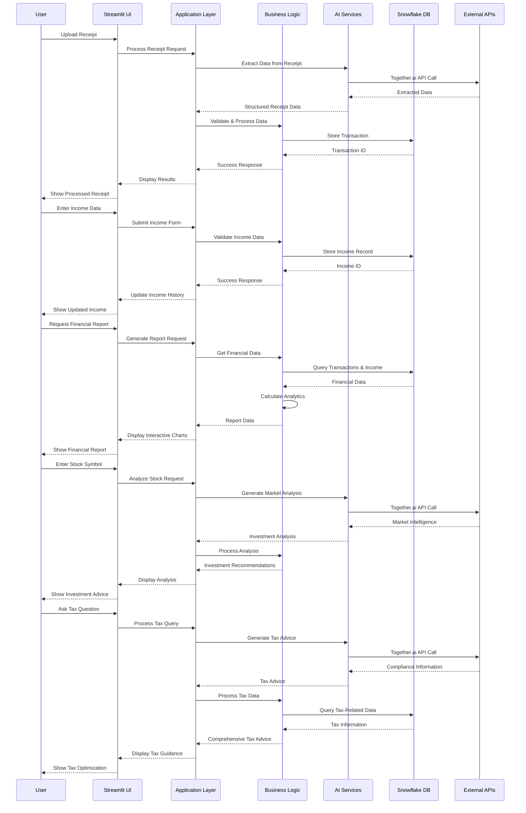

# FinAI - System Architecture Diagram

## 🏗️ Complete System Architecture

```mermaid
graph TB
    %% User Interface Layer
    subgraph "🖥️ User Interface Layer"
        UI1[Streamlit Web App<br/>Port: 8501<br/>Framework: Streamlit 1.46+]
        UI2[Responsive Design<br/>Mobile & Desktop<br/>Real-time Updates]
        UI3[Interactive Components<br/>Forms, Charts, Tables<br/>File Upload]
    end

    %% Frontend Components
    subgraph "📱 Frontend Components"
        FC1[Receipt Upload<br/>- File Uploader<br/>- Text Input<br/>- Bulk Processing]
        FC2[Income Management<br/>- Entry Forms<br/>- History View<br/>- Trends Display]
        FC3[Financial Reports<br/>- Interactive Charts<br/>- KPI Metrics<br/>- Time Period Selector]
        FC4[Tax & Compliance<br/>- Tax Summary<br/>- Q&A Chat<br/>- Deduction Finder]
        FC5[Savings & Investing<br/>- Goal Setting<br/>- AI Advice<br/>- Projections]
        FC6[Investment Planning<br/>- Stock Analysis<br/>- Market Intelligence<br/>- Risk Assessment]
    end

    %% Application Layer
    subgraph "⚙️ Application Layer"
        AL1[Main Application<br/>app.py<br/>Tab Management<br/>Session State]
        AL2[Streamlit Session<br/>State Management<br/>User Preferences<br/>Cache Management]
        AL3[Error Handling<br/>Exception Management<br/>User Feedback<br/>Logging]
    end

    %% Business Logic Layer
    subgraph "🧠 Business Logic Layer"
        BL1[TransactionManager<br/>- log_receipt()<br/>- log_bulk_receipts()<br/>- get_recent_transactions()<br/>- update_category()<br/>- get_spending_analytics()]
        BL2[IncomeManager<br/>- log_income()<br/>- get_income()<br/>- get_income_report()<br/>- get_monthly_income_average()]
        BL3[Financial Analytics<br/>- get_combined_financial_report()<br/>- calculate_monthly_trend()<br/>- get_categorical_summary()]
        BL4[Tax Optimization<br/>- TaxComplianceAssistant<br/>- TaxOptimizationDashboard<br/>- Compliance Q&A]
        BL5[Investment Planning<br/>- MarketIntelligence<br/>- InvestmentAdvisor<br/>- Risk Assessment]
    end

    %% AI Services Layer
    subgraph "🤖 AI Services Layer"
        AI1[Together.ai Client<br/>- Document Processing<br/>- Text Generation<br/>- JSON Generation<br/>Model: Mistral-7B-Instruct]
        AI2[OCR Processing<br/>- Pytesseract<br/>- Image Text Extraction<br/>- Multi-language Support]
        AI3[PDF Processing<br/>- PyPDF2<br/>- Text Extraction<br/>- Metadata Handling]
        AI4[Data Validation<br/>- Confidence Scoring<br/>- Error Detection<br/>- Quality Assessment]
    end

    %% External APIs
    subgraph "🌐 External APIs"
        API1[Together.ai API<br/>- AI Document Analysis<br/>- Financial Advice<br/>- Investment Recommendations<br/>Rate Limit: Based on plan]
        API2[Snowflake API<br/>- Database Operations<br/>- Query Execution<br/>- Data Warehousing<br/>Connection Pooling]
    end

    %% Data Processing Layer
    subgraph "📊 Data Processing Layer"
        DP1[Data Extraction<br/>- Receipt Parsing<br/>- Field Recognition<br/>- Confidence Scoring]
        DP2[Data Validation<br/>- Required Fields<br/>- Data Types<br/>- Business Rules]
        DP3[Data Transformation<br/>- Format Standardization<br/>- Category Mapping<br/>- Date Normalization]
        DP4[Data Aggregation<br/>- Time-based Grouping<br/>- Category Summaries<br/>- Trend Analysis]
    end

    %% Database Layer
    subgraph "🗄️ Database Layer (Snowflake)"
        DB1[transactions Table<br/>- id (STRING PK)<br/>- date (TIMESTAMP_NTZ)<br/>- merchant (STRING)<br/>- amount (FLOAT)<br/>- category (STRING)<br/>- confidence_scores (FLOAT)<br/>- is_reconciled (BOOLEAN)]
        DB2[income Table<br/>- id (STRING PK)<br/>- date (TIMESTAMP_NTZ)<br/>- source (STRING)<br/>- amount (FLOAT)<br/>- category (STRING)<br/>- payment_method (STRING)<br/>- is_taxable (BOOLEAN)<br/>- tags (ARRAY)]
        DB3[Database Views<br/>- enriched_transactions<br/>- income_summary<br/>- financial_reports<br/>- tax_summary]
        DB4[Data Warehouse<br/>- FINAI_WH (Warehouse)<br/>- FINAI_DB (Database)<br/>- FINAI_SCHEMA (Schema)]
    end

    %% Security Layer
    subgraph "🔐 Security Layer"
        SEC1[Authentication<br/>- API Key Management<br/>- Database Credentials<br/>- Session Security]
        SEC2[Data Protection<br/>- Encryption at Rest<br/>- Encryption in Transit<br/>- Access Control]
        SEC3[Input Validation<br/>- SQL Injection Prevention<br/>- XSS Protection<br/>- File Upload Security]
    end

    %% Configuration Layer
    subgraph "⚙️ Configuration Layer"
        CFG1[Environment Variables<br/>- TOGETHER_API_KEY<br/>- SNOWFLAKE_*<br/>- Application Settings]
        CFG2[Streamlit Secrets<br/>- API Keys<br/>- Database Credentials<br/>- Feature Flags]
        CFG3[Application Config<br/>- Model Parameters<br/>- UI Settings<br/>- Performance Tuning]
    end

    %% Monitoring & Logging
    subgraph "📈 Monitoring & Logging"
        ML1[Application Logs<br/>- Error Logging<br/>- Performance Metrics<br/>- User Actions]
        ML2[Database Monitoring<br/>- Query Performance<br/>- Connection Health<br/>- Storage Usage]
        ML3[API Monitoring<br/>- Response Times<br/>- Error Rates<br/>- Usage Analytics]
    end

    %% Connections - User Interface to Application
    UI1 --> AL1
    UI2 --> AL1
    UI3 --> AL1

    %% Connections - Frontend Components to Application
    FC1 --> AL1
    FC2 --> AL1
    FC3 --> AL1
    FC4 --> AL1
    FC5 --> AL1
    FC6 --> AL1

    %% Connections - Application to Business Logic
    AL1 --> BL1
    AL1 --> BL2
    AL1 --> BL3
    AL1 --> BL4
    AL1 --> BL5

    %% Connections - Business Logic to AI Services
    BL1 --> AI1
    BL4 --> AI1
    BL5 --> AI1
    BL1 --> AI2
    BL1 --> AI3
    BL1 --> AI4

    %% Connections - AI Services to External APIs
    AI1 --> API1
    AI2 --> API1
    AI3 --> API1

    %% Connections - Business Logic to Data Processing
    BL1 --> DP1
    BL2 --> DP2
    BL3 --> DP3
    BL3 --> DP4

    %% Connections - Data Processing to Database
    DP1 --> DB1
    DP2 --> DB2
    DP3 --> DB1
    DP3 --> DB2
    DP4 --> DB3

    %% Connections - Business Logic to Database
    BL1 --> DB1
    BL2 --> DB2
    BL3 --> DB3
    BL3 --> DB4

    %% Connections - Database to External APIs
    DB4 --> API2

    %% Connections - Security to all layers
    SEC1 --> AL1
    SEC2 --> DB4
    SEC3 --> FC1

    %% Connections - Configuration to all layers
    CFG1 --> AI1
    CFG2 --> AL1
    CFG3 --> AL1

    %% Connections - Monitoring to all layers
    ML1 --> AL1
    ML2 --> DB4
    ML3 --> API1

    %% Styling
    classDef uiClass fill:#e3f2fd,stroke:#1976d2,stroke-width:2px
    classDef fcClass fill:#f3e5f5,stroke:#7b1fa2,stroke-width:2px
    classDef alClass fill:#e8f5e8,stroke:#388e3c,stroke-width:2px
    classDef blClass fill:#fff3e0,stroke:#f57c00,stroke-width:2px
    classDef aiClass fill:#fce4ec,stroke:#c2185b,stroke-width:2px
    classDef apiClass fill:#e0f2f1,stroke:#00695c,stroke-width:2px
    classDef dpClass fill:#f1f8e9,stroke:#689f38,stroke-width:2px
    classDef dbClass fill:#fff8e1,stroke:#ff8f00,stroke-width:2px
    classDef secClass fill:#ffebee,stroke:#d32f2f,stroke-width:2px
    classDef cfgClass fill:#e8eaf6,stroke:#3f51b5,stroke-width:2px
    classDef mlClass fill:#e0f7fa,stroke:#0097a7,stroke-width:2px

    class UI1,UI2,UI3 uiClass
    class FC1,FC2,FC3,FC4,FC5,FC6 fcClass
    class AL1,AL2,AL3 alClass
    class BL1,BL2,BL3,BL4,BL5 blClass
    class AI1,AI2,AI3,AI4 aiClass
    class API1,API2 apiClass
    class DP1,DP2,DP3,DP4 dpClass
    class DB1,DB2,DB3,DB4 dbClass
    class SEC1,SEC2,SEC3 secClass
    class CFG1,CFG2,CFG3 cfgClass
    class ML1,ML2,ML3 mlClass
```

## 🏗️ Architecture Details

### **1. User Interface Layer (🖥️)**
- **Technology**: Streamlit 1.46+
- **Port**: 8501
- **Features**: Responsive design, real-time updates, interactive components
- **Components**: Forms, charts, tables, file uploaders

### **2. Frontend Components (📱)**
- **Receipt Upload**: File uploader, text input, bulk processing
- **Income Management**: Entry forms, history view, trends display
- **Financial Reports**: Interactive charts, KPI metrics, time period selector
- **Tax & Compliance**: Tax summary, Q&A chat, deduction finder
- **Savings & Investing**: Goal setting, AI advice, projections
- **Investment Planning**: Stock analysis, market intelligence, risk assessment

### **3. Application Layer (⚙️)**
- **Main Application**: app.py with tab management and session state
- **Session Management**: User preferences, cache management, state persistence
- **Error Handling**: Exception management, user feedback, comprehensive logging

### **4. Business Logic Layer (🧠)**
- **TransactionManager**: Handles all transaction operations
- **IncomeManager**: Manages income data and reporting
- **Financial Analytics**: Generates comprehensive financial reports
- **Tax Optimization**: Provides tax advice and compliance guidance
- **Investment Planning**: Offers investment recommendations and analysis

### **5. AI Services Layer (🤖)**
- **Together.ai Client**: Unified AI service using Mistral-7B-Instruct model
- **OCR Processing**: Pytesseract for image text extraction
- **PDF Processing**: PyPDF2 for PDF text extraction
- **Data Validation**: Confidence scoring and quality assessment

### **6. External APIs (🌐)**
- **Together.ai API**: AI document analysis, financial advice, investment recommendations
- **Snowflake API**: Database operations, query execution, data warehousing

### **7. Data Processing Layer (📊)**
- **Data Extraction**: Receipt parsing, field recognition, confidence scoring
- **Data Validation**: Required fields, data types, business rules
- **Data Transformation**: Format standardization, category mapping, date normalization
- **Data Aggregation**: Time-based grouping, category summaries, trend analysis

### **8. Database Layer (🗄️)**
- **transactions Table**: Stores expense data with confidence scores
- **income Table**: Stores income records with categorization
- **Database Views**: Optimized views for reporting and analytics
- **Data Warehouse**: FINAI_WH, FINAI_DB, FINAI_SCHEMA

### **9. Security Layer (🔐)**
- **Authentication**: API key management, database credentials, session security
- **Data Protection**: Encryption at rest and in transit, access control
- **Input Validation**: SQL injection prevention, XSS protection, file upload security

### **10. Configuration Layer (⚙️)**
- **Environment Variables**: API keys, database credentials, application settings
- **Streamlit Secrets**: Secure storage for sensitive configuration
- **Application Config**: Model parameters, UI settings, performance tuning

### **11. Monitoring & Logging (📈)**
- **Application Logs**: Error logging, performance metrics, user actions
- **Database Monitoring**: Query performance, connection health, storage usage
- **API Monitoring**: Response times, error rates, usage analytics

## 🔄 Data Flow Architecture



## 🛠️ Technology Stack Details

### **Frontend Technologies:**
- **Streamlit**: Web application framework
- **Plotly**: Interactive visualizations
- **Pandas**: Data manipulation and display
- **HTML/CSS**: Custom styling and layout

### **Backend Technologies:**
- **Python 3.8+**: Core programming language
- **Together.ai**: AI document processing and analysis
- **Snowflake**: Cloud data warehouse
- **PyPDF2**: PDF text extraction
- **Pytesseract**: OCR for image processing
- **Pillow**: Image processing

### **Database Technologies:**
- **Snowflake**: Cloud data warehouse
- **SQL**: Query language
- **Connection Pooling**: Performance optimization
- **Views**: Optimized data access

### **AI/ML Technologies:**
- **Together.ai API**: Unified AI platform
- **Mistral-7B-Instruct**: Large language model
- **JSON Generation**: Structured data output
- **Confidence Scoring**: Data quality assessment

### **Security Technologies:**
- **Streamlit Secrets**: Secure configuration management
- **Environment Variables**: API key management
- **Input Validation**: Security measures
- **HTTPS**: Secure communication

### **Monitoring Technologies:**
- **Application Logging**: Error tracking
- **Performance Monitoring**: Response time tracking
- **Database Monitoring**: Query optimization
- **API Monitoring**: Usage analytics

This architecture provides a comprehensive view of the FinAI system's structure, showing how all components interact to deliver AI-powered financial management capabilities. 