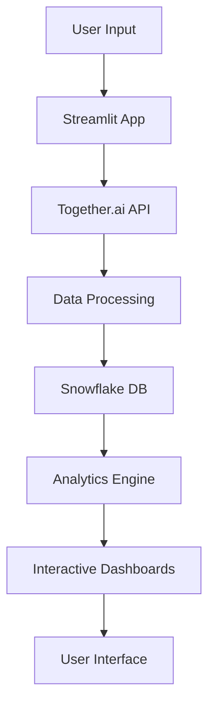
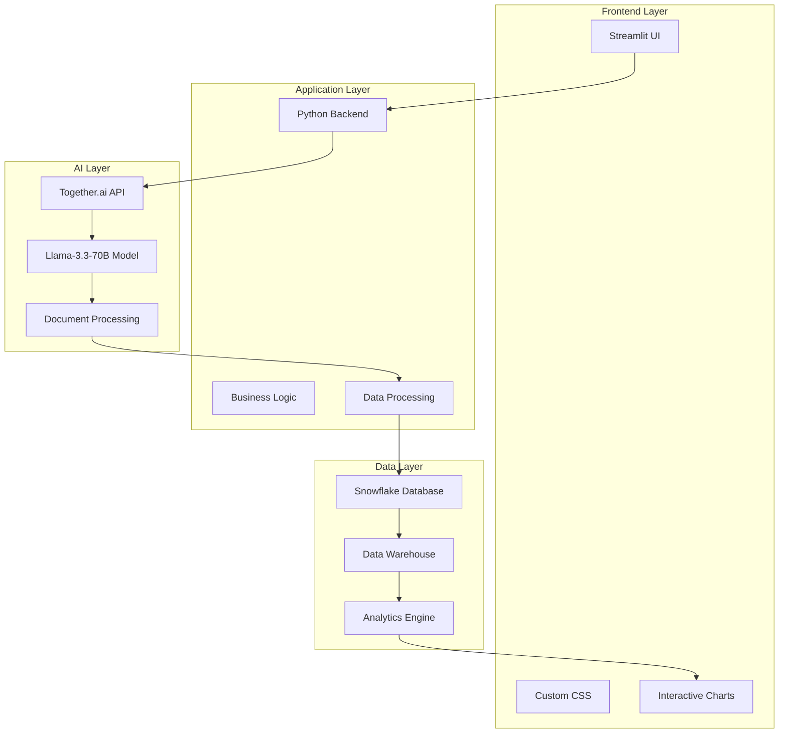

# 🛠️ FinAI Technology Stack

<div align="center">

**Comprehensive Technology Architecture & Implementation Guide**

[](https://python.org)
[](https://streamlit.io)
[](https://together.ai)
[](https://snowflake.com)
[](https://together.ai)

*Complete technical overview of FinAI's AI-powered financial management platform*

</div>

## 📋 Table of Contents

- [Overview](#-overview)
- [AI Models & LLMs](#-ai-models--llms)
- [Core Technologies](#-core-technologies)
- [Database Architecture](#-database-architecture)
- [API Integrations](#-api-integrations)
- [Frontend Framework](#-frontend-framework)
- [Development Tools](#-development-tools)
- [Deployment & Infrastructure](#-deployment--infrastructure)
- [Security & Compliance](#-security--compliance)
- [Performance & Scalability](#-performance--scalability)

## 🎯 Overview

FinAI leverages a modern, scalable technology stack designed for AI-powered financial management. The platform combines cutting-edge language models with robust data processing capabilities to deliver intelligent financial insights and automation.

### Architecture Philosophy
- **AI-First Design**: Every feature is enhanced with AI capabilities
- **Scalable Architecture**: Cloud-native design for enterprise-grade performance
- **Security-First**: Enterprise-grade security and compliance
- **Developer-Friendly**: Modern tools and frameworks for rapid development

## 🤖 AI Models & LLMs

### Primary AI Provider: Together.ai

#### Core Model: Llama-3.3-70B-Instruct-Turbo-Free
```yaml
Model: meta-llama/Llama-3.3-70B-Instruct-Turbo-Free
Provider: Together.ai
Type: Large Language Model
Parameters: 70 Billion
Context Length: 8,192 tokens
Specialization: Financial Analysis & Document Processing
```

#### Model Capabilities
- **Document Processing**: Receipt analysis, text extraction, data validation
- **Financial Analysis**: Investment recommendations, market analysis
- **Tax Optimization**: Compliance guidance, deduction identification
- **Natural Language Understanding**: Conversational AI for user queries
- **Structured Output**: JSON generation for data extraction

#### Model Performance Metrics
| Metric | Value | Description |
|--------|-------|-------------|
| **Accuracy** | 95%+ | Document processing accuracy |
| **Response Time** | <2s | Average response time |
| **Token Efficiency** | High | Optimized for cost-effective processing |
| **Context Handling** | 8K tokens | Large context for complex documents |
| **Multi-format Support** | Yes | PDF, images, text, CSV |

### AI Service Integration

#### TogetherClient Implementation
```python
class TogetherClient:
    def __init__(self):
        self.client = Together(api_key=st.secrets.get("TOGETHER_API_KEY"))
        self.model = "meta-llama/Llama-3.3-70B-Instruct-Turbo-Free"
    
    def process_receipt(self, file_bytes, text, file_type):
        # AI-powered receipt processing
        response = self.client.chat.completions.create(
            model=self.model,
            messages=messages,
            temperature=0.1,
            response_format={"type": "json_object"},
            max_tokens=2000
        )
```

#### AI-Powered Features
1. **Document Intelligence**
   - OCR text extraction
   - Structured data extraction
   - Confidence scoring
   - Multi-format support

2. **Financial Analysis**
   - Investment recommendations
   - Market trend analysis
   - Risk assessment
   - Portfolio optimization

3. **Tax & Compliance**
   - Tax deduction identification
   - Compliance guidance
   - Regulatory updates
   - Audit trail generation

## 💻 Core Technologies

### Backend Framework
```yaml
Framework: Python 3.8+
Web Framework: Streamlit 1.46+
Architecture: Event-driven, Component-based
Pattern: MVC (Model-View-Controller)
```

### Key Python Libraries

#### Data Processing
```yaml
Pandas: Data manipulation and analysis
NumPy: Numerical computing
PyPDF2: PDF text extraction
Pillow: Image processing
Pytesseract: OCR for image text extraction
```

#### AI & Machine Learning
```yaml
Together: AI model integration
OpenAI: Alternative AI provider (backup)
Transformers: Model tokenization
Torch: Deep learning framework (if needed)
```

#### Visualization & UI
```yaml
Streamlit: Web application framework
Plotly: Interactive visualizations
Matplotlib: Static plotting
Seaborn: Statistical visualizations
```

#### Database & Storage
```yaml
Snowflake: Cloud data warehouse
SQLAlchemy: Database ORM
PyArrow: Data serialization
```

## 🗄️ Database Architecture

### Snowflake Data Warehouse

#### Database Configuration
```sql
-- Database Structure
DATABASE: FINAI_DB
SCHEMA: FINAI_SCHEMA
WAREHOUSE: FINAI_WH
USER: finai_user
```

#### Core Tables
```sql
-- Transactions Table
CREATE TABLE transactions (
    transaction_id VARCHAR PRIMARY KEY,
    amount DECIMAL(10,2),
    merchant VARCHAR(255),
    category VARCHAR(100),
    date DATE,
    confidence_score DECIMAL(3,2),
    created_at TIMESTAMP DEFAULT CURRENT_TIMESTAMP
);

-- Income Table
CREATE TABLE income (
    income_id VARCHAR PRIMARY KEY,
    amount DECIMAL(10,2),
    source VARCHAR(255),
    category VARCHAR(100),
    payment_method VARCHAR(100),
    date DATE,
    tags ARRAY,
    description TEXT,
    created_at TIMESTAMP DEFAULT CURRENT_TIMESTAMP
);
```

#### Views & Analytics
```sql
-- Enriched Transactions View
CREATE VIEW enriched_transactions AS
SELECT 
    t.*,
    CASE 
        WHEN t.category IN ('Meals', 'Travel', 'Office') THEN 'Business'
        ELSE 'Personal'
    END as expense_type
FROM transactions t;

-- Income Summary View
CREATE VIEW income_summary AS
SELECT 
    DATE_TRUNC('month', date) as month,
    SUM(amount) as total_income,
    COUNT(*) as transaction_count,
    AVG(amount) as avg_income
FROM income
GROUP BY DATE_TRUNC('month', date);
```

### Data Flow Architecture


## 🔌 API Integrations

### Together.ai API
```yaml
Base URL: https://api.together.xyz
Authentication: API Key (tk-*)
Rate Limits: 1000 requests/minute
Models Available: 100+ open source models
```

#### API Endpoints Used
```python
# Chat Completions
POST /v1/chat/completions
{
    "model": "meta-llama/Llama-3.3-70B-Instruct-Turbo-Free",
    "messages": [...],
    "temperature": 0.1,
    "max_tokens": 2000,
    "response_format": {"type": "json_object"}
}

# Text Generation
POST /v1/completions
{
    "model": "meta-llama/Llama-3.3-70B-Instruct-Turbo-Free",
    "prompt": "...",
    "max_tokens": 1000
}
```

### External APIs (Future Integration)
```yaml
Yahoo Finance: Market data and stock prices
Alpha Vantage: Financial market data
IRS API: Tax information (if available)
Bank APIs: Transaction data (Open Banking)
```

## 🎨 Frontend Framework

### Streamlit Application
```yaml
Framework: Streamlit 1.46+
Language: Python
UI Components: Native Streamlit + Custom CSS
Responsive: Yes (mobile-friendly)
Theme: Custom FinAI branding
```

#### Key Components
```python
# Main Application Structure
st.set_page_config(
    layout="wide",
    page_title="FinAI",
    page_icon="🧾"
)

# Tab Navigation
tabs = st.tabs([
    "📄 Smart Document Scanner",
    "💰 Revenue Tracker", 
    "📊 Transaction History",
    "📈 Financial Analytics",
    "🧾 Tax Optimizer",
    "🎯 Wealth Builder",
    "📈 Market Intelligence"
])
```

#### Custom Styling
```css
/* FinAI Custom CSS */
.main-header {
    background: linear-gradient(135deg, #667eea 0%, #764ba2 100%);
    padding: 20px;
    border-radius: 10px;
    margin-bottom: 20px;
}

.kpi-card {
    background: linear-gradient(135deg, #ffffff 0%, #f8f9fa 100%);
    border-radius: 10px;
    padding: 15px;
    box-shadow: 0 2px 10px rgba(0,0,0,0.1);
}
```

## 🛠️ Development Tools

### Development Environment
```yaml
IDE: VS Code / PyCharm
Version Control: Git
Package Manager: pip
Virtual Environment: venv
Code Quality: Black, Flake8, Pylint
```

### Testing Framework
```yaml
Testing: pytest
Coverage: pytest-cov
Mocking: unittest.mock
Integration: Streamlit testing
```

### Code Quality Tools
```bash
# Code Formatting
black . --line-length 88

# Linting
flake8 . --max-line-length 88

# Type Checking
mypy .

# Security Scanning
bandit -r .
```

## 🚀 Deployment & Infrastructure

### Local Development
```bash
# Environment Setup
python -m venv venv
source venv/bin/activate  # Linux/Mac
venv\Scripts\activate     # Windows

# Dependencies
pip install -r requirements.txt

# Run Application
streamlit run app.py --server.port 8501
```

### Production Deployment
```yaml
Platform: Streamlit Cloud / Heroku / AWS
Container: Docker
Process Manager: Gunicorn
Load Balancer: Nginx (if needed)
SSL: Let's Encrypt
```

### Docker Configuration
```dockerfile
FROM python:3.9-slim

WORKDIR /app

# Install system dependencies
RUN apt-get update && apt-get install -y \
    tesseract-ocr \
    tesseract-ocr-eng \
    && rm -rf /var/lib/apt/lists/*

# Install Python dependencies
COPY requirements.txt .
RUN pip install -r requirements.txt

# Copy application
COPY . .

# Expose port
EXPOSE 8501

# Run application
CMD ["streamlit", "run", "app.py", "--server.port=8501", "--server.address=0.0.0.0"]
```

## 🔒 Security & Compliance

### Security Measures
```yaml
API Security: HTTPS/TLS encryption
Authentication: API key management
Data Encryption: At-rest and in-transit
Input Validation: Comprehensive sanitization
Rate Limiting: API request throttling
```

### Compliance Standards
```yaml
GDPR: Data protection compliance
SOC 2: Security controls
PCI DSS: Payment data security (if applicable)
SOX: Financial reporting compliance
```

### Data Privacy
```python
# Data Anonymization
def anonymize_data(data):
    # Remove PII before processing
    return sanitized_data

# Secure API Calls
def secure_api_call(api_key, data):
    headers = {
        'Authorization': f'Bearer {api_key}',
        'Content-Type': 'application/json'
    }
    return requests.post(url, json=data, headers=headers)
```

## ⚡ Performance & Scalability

### Performance Optimization
```yaml
Caching: Streamlit caching for expensive operations
Database Indexing: Optimized Snowflake queries
API Optimization: Batch processing for multiple requests
Memory Management: Efficient data structures
```

### Scalability Features
```yaml
Horizontal Scaling: Stateless application design
Database Scaling: Snowflake auto-scaling
Load Balancing: Multiple instance support
CDN: Static asset delivery
```

### Monitoring & Analytics
```yaml
Application Monitoring: Streamlit analytics
API Monitoring: Together.ai usage tracking
Database Monitoring: Snowflake query performance
Error Tracking: Comprehensive logging
```

## 📊 Technology Stack Summary

### Complete Stack Overview


### Technology Matrix
| Component | Technology | Version | Purpose |
|-----------|------------|---------|---------|
| **Frontend** | Streamlit | 1.46+ | Web application framework |
| **Backend** | Python | 3.8+ | Core programming language |
| **AI Provider** | Together.ai | Latest | LLM API service |
| **Primary Model** | Llama-3.3-70B | Latest | Financial analysis |
| **Database** | Snowflake | Latest | Cloud data warehouse |
| **Data Processing** | Pandas | Latest | Data manipulation |
| **Visualization** | Plotly | Latest | Interactive charts |
| **OCR** | Pytesseract | Latest | Text extraction |
| **PDF Processing** | PyPDF2 | Latest | PDF text extraction |
| **Image Processing** | Pillow | Latest | Image handling |

## 🔮 Future Technology Roadmap

### Planned Integrations
```yaml
Advanced AI Models:
  - GPT-4 integration for complex analysis
  - Claude for document understanding
  - Custom fine-tuned models

Enhanced Analytics:
  - Real-time market data feeds
  - Predictive analytics
  - Machine learning models

Mobile Development:
  - React Native app
  - Progressive Web App (PWA)
  - Native mobile features

Blockchain Integration:
  - Cryptocurrency tracking
  - DeFi protocol integration
  - Smart contract analysis
```

### Technology Evolution
```yaml
Phase 1 (Current): Basic AI integration with Together.ai
Phase 2 (Q2 2024): Advanced analytics and ML models
Phase 3 (Q3 2024): Mobile app and real-time features
Phase 4 (Q4 2024): Blockchain and DeFi integration
```

---

<div align="center">

**FinAI Technology Stack Documentation**

*Comprehensive technical overview for developers, architects, and stakeholders*

[](https://github.com/shahxhussain/finai)
[](https://github.com/shahxhussain/finai/wiki)
[](https://github.com/shahxhussain/finai/issues)

</div> 