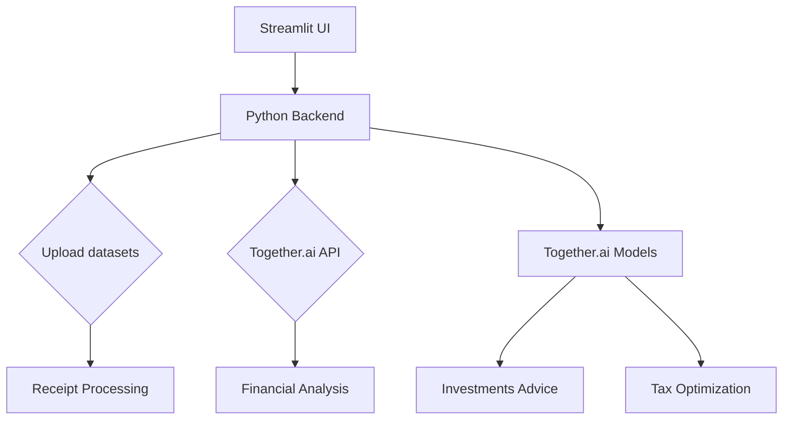

# FinAI - Your AI-Powered Financial Companion

<div align="center">


**Intelligent Financial Management Platform**

[](https://python.org)
[](https://streamlit.io)
[](https://together.ai)
[](https://snowflake.com)

*Transform your personal finance management with AI-powered insights and automation*

</div>

## 📋 Table of Contents

- [Overview](#-overview)
- [Key Features](#-key-features)
- [Technology Stack](#-technology-stack)
- [Quick Start](#-quick-start)
- [Detailed Setup](#-detailed-setup)
- [Usage Guide](#-usage-guide)
- [API Configuration](#-api-configuration)
- [Database Setup](#-database-setup)
- [Troubleshooting](#-troubleshooting)
- [Contributing](#-contributing)
- [License](#-license)

## 📌 Overview

FinAI is an intelligent financial management platform that combines cutting-edge AI technology with comprehensive financial tools to provide:

- **AI-powered receipt processing** with automatic categorization
- **Automated tax optimization** and compliance guidance
- **Smart investment recommendations** based on market analysis
- **Goal-based savings planning** with AI-driven insights
- **Comprehensive financial reporting** and analytics

Built with modern technologies including Together.ai, Snowflake, and Streamlit, FinAI transforms personal finance management through automation and AI-driven insights.

---
## 📖 Usage Guide

### Receipt Processing

#### Single Receipt
1. Navigate to "Upload Receipt" tab
2. Upload a receipt file (PDF, image, or text)
3. Or paste receipt text directly
4. Click "Process Receipt"
5. Review extracted data and save to database

#### Bulk Processing
1. Upload multiple receipt files
2. Click "Process Multiple Receipts"
3. Review summary table
4. Save all transactions or edit individually

### Income Management
1. Go to "Income Management" tab
2. Fill in income details:
   - Amount
   - Source
   - Payment method
   - Category
   - Date received
3. Add tags and description
4. Click "Record Income"

### Financial Reports
1. Navigate to "Financial Reports" tab
2. Select time period (Week, Month, Quarter, Year)
3. View comprehensive analytics:
   - Income vs Expenses
   - Category breakdowns
   - Trend analysis
   - KPI metrics

### Tax & Compliance
1. Go to "Tax & Compliance" tab
2. View tax summary and deductible expenses
3. Ask compliance questions in the chat interface
4. Get AI-powered tax advice

### Investment Planning
1. Navigate to "Investment Planning" tab
2. Enter stock symbol for analysis
3. View comprehensive market analysis
4. Get investment recommendations

### Savings & Investing
1. Go to "Savings & Investing" tab
2. Set financial goals
3. Choose risk profile
4. Get AI-generated investment advice
5. View savings projections
---

## ✨ Key Features

### 🔍 Smart Receipt Processing
- 📷 Upload receipts in multiple formats (PDF, images, CSV, text)
- 🔍 AI extracts merchant, amount, date, and category automatically
- 📊 Automatic expense categorization with confidence scoring
- 💾 Export to accounting software and database storage
- ⚡ Bulk processing for multiple receipts

### 💰 Income Management
- 📈 Track various income sources with categorization
- 💳 Support for multiple payment methods
- 🔄 Recurring income tracking
- 📊 Monthly trends and source breakdown
- 🏷️ Tax categorization (taxable/non-taxable)

### 📊 Financial Reports & Analytics
- 📈 Comprehensive dashboards with interactive visualizations
- 📅 Time period analysis (week, month, quarter, year)
- 📊 KPI metrics with trend analysis
- 🔄 Comparative analysis (current vs previous periods)
- 📋 Category breakdown and expense tracking

### 🧾 Tax & Compliance
- 🤖 AI-powered tax advice using Together.ai
- 💡 Automatic deduction identification
- 📅 Quarterly and annual tax liability calculations
- ⚖️ GDPR and fintech regulation guidance
- 💬 Interactive Q&A for tax questions

### 💹 Investment Planning
- 📈 Market intelligence with AI analysis
- 🔍 Technical and fundamental analysis
- ⚖️ Risk assessment and scoring
- 💡 Buy/hold/sell recommendations with price targets
- 📊 Portfolio optimization suggestions

### 🎯 Savings & Investment
- 🎯 Goal-based savings with timeline projections
- 🤖 AI investment advice and portfolio recommendations
- ⚖️ Risk assessment (Conservative, Moderate, Aggressive)
- 📈 Compound interest projections
- 📊 Financial snapshot and position analysis

## 🛠️ Technology Stack

### AI Core
| Technology | Purpose |
|------------|---------|
| **Together.ai** | Unified AI platform for document processing, financial analysis, investment recommendations, and tax optimization |
| **Cursor** | Prompt-to-code for UI generation and dashboard components |

### Application Stack


### Core Dependencies
- **Streamlit** - Web application framework
- **Together.ai** - AI document processing and analysis
- **Snowflake** - Cloud data warehouse
- **Pandas** - Data manipulation and analysis
- **Plotly** - Interactive visualizations
- **PyPDF2** - PDF text extraction
- **Pillow** - Image processing
- **Pytesseract** - OCR for image text extraction

## 🚀 Quick Start

### Prerequisites
- Python 3.8 or higher
- Git
- Together.ai API key
- Snowflake account (free trial available)

### 1. Clone the Repository
```bash
git clone https://github.com/yourusername/finai.git
cd finai
```

### 2. Set Up Virtual Environment
```bash
# Create virtual environment
python -m venv venv

# Activate virtual environment
# On Windows:
venv\Scripts\activate
# On Mac/Linux:
source venv/bin/activate
```

### 3. Install Dependencies
```bash
pip install -r requirements.txt
```

### 4. Configure Environment
```bash
# Create Streamlit secrets directory
mkdir .streamlit

# Create secrets file
touch .streamlit/secrets.toml
```

### 5. Add Your API Keys
Edit `.streamlit/secrets.toml`:
```toml
# Together.ai API Key
TOGETHER_API_KEY = "your_together_api_key_here"

# Snowflake Configuration
SNOWFLAKE_USER = "your_snowflake_username"
SNOWFLAKE_PASSWORD = "your_snowflake_password"
SNOWFLAKE_ACCOUNT = "your_snowflake_account"
SNOWFLAKE_WAREHOUSE = "your_snowflake_warehouse"
SNOWFLAKE_DATABASE = "your_snowflake_database"
SNOWFLAKE_SCHEMA = "your_snowflake_schema"
```

### 6. Run the Application
```bash
streamlit run app.py
```

The application will be available at `http://localhost:8501`

## 📋 Detailed Setup

### API Configuration

#### Together.ai Setup
1. Visit [Together.ai](https://together.ai)
2. Sign up for a free account
3. Navigate to API Keys section
4. Create a new API key
5. Copy the key (starts with `tk-`)

#### Snowflake Setup
1. Visit [Snowflake](https://www.snowflake.com)
2. Sign up for a free trial (30 days, $400 credit)
3. Choose your cloud provider (AWS, Azure, or GCP)
4. Select a region close to you
5. Create your account

### Database Setup

#### 1. Get Connection Details
- **Account URL**: Look at your browser URL when logged in
- **Format**: `https://your-account.snowflakecomputing.com`
- **Account Identifier**: `your-account`

#### 2. Create Database Objects
Run these SQL commands in Snowflake console:

```sql
-- Create Warehouse
CREATE WAREHOUSE IF NOT EXISTS FINAI_WH
WAREHOUSE_SIZE = 'X-SMALL'
AUTO_SUSPEND = 60
AUTO_RESUME = TRUE;

-- Create Database
CREATE DATABASE IF NOT EXISTS FINAI_DB;

-- Create Schema
USE DATABASE FINAI_DB;
CREATE SCHEMA IF NOT EXISTS FINAI_SCHEMA;

-- Create User (Optional)
CREATE USER IF NOT EXISTS finai_user
PASSWORD = 'your_secure_password'
DEFAULT_ROLE = 'PUBLIC'
DEFAULT_WAREHOUSE = 'FINAI_WH'
DEFAULT_DATABASE = 'FINAI_DB'
DEFAULT_SCHEMA = 'FINAI_SCHEMA';
```

#### 3. Update Configuration
Update your `.streamlit/secrets.toml` with the actual values:

```toml
SNOWFLAKE_USER = "finai_user"
SNOWFLAKE_PASSWORD = "your_secure_password"
SNOWFLAKE_ACCOUNT = "your-account"
SNOWFLAKE_WAREHOUSE = "FINAI_WH"
SNOWFLAKE_DATABASE = "FINAI_DB"
SNOWFLAKE_SCHEMA = "FINAI_SCHEMA"
```

## 🔧 Troubleshooting

### Common Issues

#### Snowflake Connection Problems
**Error: "Failed to initialize database"**
```bash
# Check warehouse status
ALTER WAREHOUSE FINAI_WH RESUME;

# Verify connection details
# Ensure account identifier is correct
```

**Error: "Authentication failed"**
- Double-check username and password
- Verify account identifier format
- Test login via Snowflake console

#### Together.ai API Issues
**Error: "TOGETHER_API_KEY not found"**
- Check if API key is in `.streamlit/secrets.toml`
- Verify API key format (starts with `tk-`)
- Test API key on Together.ai console

#### Python Dependencies
**Error: "Module not found"**
```bash
# Reinstall dependencies
pip install -r requirements.txt --force-reinstall

# Check Python version
python --version  # Should be 3.8+
```

### Performance Optimization

#### Snowflake Cost Management
```sql
-- Suspend warehouse when not in use
ALTER WAREHOUSE FINAI_WH SUSPEND;

-- Resume when needed
ALTER WAREHOUSE FINAI_WH RESUME;

-- Monitor usage
SELECT * FROM TABLE(INFORMATION_SCHEMA.WAREHOUSE_METERING_HISTORY(
    DATE_RANGE_START=>DATEADD('day', -7, CURRENT_DATE()),
    DATE_RANGE_END=>CURRENT_DATE()
));
```

#### Application Performance
- Use bulk processing for multiple receipts
- Regularly clean up old data
- Monitor API usage and costs

## 📊 Sample Data

The project includes sample data files in the `data/` directory:
- `bill.pdf` - Sample PDF receipt
- `bill.txt` - Sample text receipt
- `digi.txt` - Sample digital receipt
- `finbro.png/jpg` - Brand assets

## 🚀 Deployment

### Local Development
```bash
# Development mode
streamlit run app.py --server.port 8501
```

### Production Deployment
```bash
# Production mode
streamlit run app.py --server.port 8501 --server.address 0.0.0.0
```

### Docker Deployment
```dockerfile
FROM python:3.9-slim

WORKDIR /app
COPY requirements.txt .
RUN pip install -r requirements.txt

COPY . .
EXPOSE 8501

CMD ["streamlit", "run", "app.py", "--server.port=8501", "--server.address=0.0.0.0"]
```

## 🤝 Contributing

We welcome contributions! Please follow these steps:

1. Fork the repository
2. Create a feature branch (`git checkout -b feature/amazing-feature`)
3. Commit your changes (`git commit -m 'Add amazing feature'`)
4. Push to the branch (`git push origin feature/amazing-feature`)
5. Open a Pull Request

### Development Setup
```bash
# Install development dependencies
pip install -r requirements.txt
pip install pytest black flake8

# Run tests
pytest

# Format code
black .

# Lint code
flake8 .
```

## 📝 License

This project is licensed under the MIT License - see the [LICENSE](LICENSE) file for details.

## 🙏 Acknowledgments

- **Together.ai** for providing the AI infrastructure
- **Snowflake** for the cloud data warehouse
- **Streamlit** for the web application framework
- **Open Source Community** for various Python packages

## 📞 Support

- **Issues**: [GitHub Issues](https://github.com/yourusername/finai/issues)
- **Documentation**: [Wiki](https://github.com/yourusername/finai/wiki)
- **Email**: support@finai.com

---

<div align="center">

**Made with ❤️ by the FinAI Team**

[](https://github.com/yourusername/finai)
[](https://github.com/yourusername/finai)
[](https://github.com/yourusername/finai/issues)

</div>
